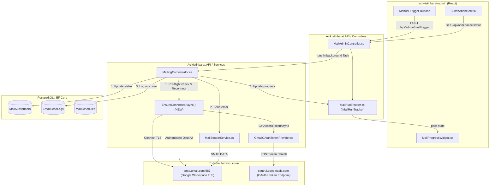

# Implementation Plan: SMTP Connection Resilience & Domino Failure Prevention (Granular)

**Document ID:** IP-MAIL-004-REV2  
**Date:** 2026-09-28  
**Source Specification:** Session Context & Debugging Analysis  
**Projects Affected:** `AcikIstihbarat.API`, `AcikIstihbarat.API.Tests`  
**Status:** Completed & Verified  

---

## 1. Executive Summary

This plan details the implementation of a resilient, fault-tolerant e-mail dispatch engine for `AcikIstihbarat-2026`. 

During automated and manual newsletter dispatches, a transient network interruption, Google Workspace SMTP rate limit (`421 4.7.0`), or socket idle timeout drops the connection to `smtp.gmail.com:587`. Because `MailingOrchestrator` does not verify connection state between recipients, a single connection drop causes every subsequent subscriber in the batch to fail with `"The SmtpClient is not connected."` (a cascading domino failure). 

Furthermore, the existing circuit breaker fails to catch `ServiceNotConnectedException`, and innocent subscribers are unfairly penalized with incremented failure counters. 

This plan introduces:
1. Pre-flight connection verification and automatic reconnection (`EnsureConnectedAsync`) with Google Workspace OAuth2 token refresh.
2. Transient error retry with exponential backoff for Google Workspace rate limits (`421`).
3. An expanded circuit breaker that properly aborts on fatal infrastructure outages.
4. Protection of subscriber reputation counters against server-side network faults.
5. Database remediation for subscribers falsely marked with failures.

---

## 2. Architecture Overview

### What is being built

* **`EnsureConnectedAsync` Helper:** A thread-safe, reusable private helper in `MailingOrchestrator` that verifies both `client.IsConnected` and `client.IsAuthenticated`. If either is false, it reconnects to `smtp.gmail.com:587` with TLS, fetches the active access token from `IGmailOAuthTokenProvider`, and performs OAuth2 SASL authentication.
* **Transient Error Handler & Single-Retry Policy:** Wraps `_mailSender.SendAsync(...)` in a retry pattern. If a transient error occurs (disconnection, socket drop, or `421` deferral), the engine applies a brief pause (e.g. 5–10 seconds), re-establishes the connection, and retries the recipient once.
* **Smart Failure Classification:** Categorizes errors into **Recipient/Mailbox Errors** (e.g., SMTP 550 Mailbox not found, invalid address) vs **Infrastructure/Transport Errors** (e.g., socket reset, timeout, 421 deferral, disconnect). Only Recipient Errors increment `subscriber.ConsecutiveFailureCount`.
* **Universal Application:** Applied identically to both regular newsletter broadcasts (`RunScheduleAsync`) and subscription confirmation dispatches (`DispatchPendingConfirmationEmailsAsync`).

### Component Diagram



---

## 3. Dependency Analysis

### 3.1 Existing Dependencies Affected

| # | Dependency | Location / Path | Change Required | Risk |
|---|------------|-----------------|-----------------|------|
| DEP-1 | `MailingOrchestrator.cs` | `AcikIstihbarat.API/Services/` | Add `EnsureConnectedAsync`, add per-message retry, fix circuit breaker, protect `ConsecutiveFailureCount` | Medium |
| DEP-2 | `EmailSendLogs` | `AcikIstihbarat.API/Models/Entities/` | Ensure accurate categorization and logging of retry/transient errors | Low |
| DEP-3 | `MailSubscribers` | Database Table | Cleanup falsely incremented failure counts from recent incident | Low |

### 3.2 New Dependencies Created
* None. Leverages existing `MailKit`, `MimeKit`, and `Microsoft.Extensions.Options`.

### 3.3 Integration Points

| # | This Component | Connects To | Protocol / Method | Contract |
|---|----------------|------------|-------------------|----------|
| INT-1 | `MailingOrchestrator` | `smtp.gmail.com:587` | SMTP over STARTTLS | MailKit `SmtpClient.ConnectAsync` / `AuthenticateAsync` |
| INT-2 | `EnsureConnectedAsync` | `IGmailOAuthTokenProvider` | In-memory DI call | Returns valid OAuth2 bearer access token string |
| INT-3 | `MailingOrchestrator` | `AppDbContext.EmailSendLogs` | EF Core `Add` & `SaveChangesAsync` | Persists log with actual error details |

---

## 4. Phased Implementation Plan

---

### Phase 1 — Core Resilience Engine in `MailingOrchestrator.cs`

**Goal:** Prevent socket dropouts from killing the dispatch loop by adding pre-flight checks and automatic reconnection.  
**Estimated Complexity:** Medium  
**Prerequisites:** None.

#### Tasks

- [x] **TASK-1.1 — Implement `EnsureConnectedAsync` Helper**
  - **What:** Add a private asynchronous helper method in `MailingOrchestrator`:
    ```csharp
    private async Task EnsureConnectedAsync(SmtpClient client, CancellationToken ct)
    {
        if (!client.IsConnected)
        {
            await client.ConnectAsync("smtp.gmail.com", 587, SecureSocketOptions.StartTls, ct);
        }
        if (!client.IsAuthenticated)
        {
            var accessToken = await _tokenProvider.GetAccessTokenAsync(ct);
            await client.AuthenticateAsync(new SaslMechanismOAuth2(_mailOptions.GmailOAuth.SenderAddress, accessToken), ct);
        }
    }
    ```
  - **Where:** `AcikIstihbarat.API/Services/MailingOrchestrator.cs`
  - **Acceptance Criteria:** Successfully reconnects and re-authenticates whenever `client.IsConnected` or `client.IsAuthenticated` is false.

- [x] **TASK-1.2 — Integrate Pre-Flight Connection Check into `RunScheduleAsync`**
  - **What:** Inside the main subscriber loop (`for (var i = 0; i < toSend.Count; i++)`), call `await EnsureConnectedAsync(client, ct);` before invoking `_mailSender.SendAsync(client, request, ct);`.
  - **Where:** `AcikIstihbarat.API/Services/MailingOrchestrator.cs` (lines 140–151)
  - **Acceptance Criteria:** If the socket closed during `Task.Delay`, it is seamlessly restored prior to the next message dispatch.

- [x] **TASK-1.3 — Implement Transient Error Retry & 421 Rate-Limit Backoff**
  - **What:** Wrap `_mailSender.SendAsync(client, request, ct)` with a one-time transient retry block:
    - If `SendAsync` throws `ServiceNotConnectedException`, `SocketException`, `IOException`, or `SmtpCommandException` (specifically StatusCode 421):
      - Log warning: `"Transient error sending to {Email}: {Error}. Retrying in 10s..."`.
      - If StatusCode is 421, wait 10 seconds (`Task.Delay(10000, ct)`).
      - Call `await EnsureConnectedAsync(client, ct);`.
      - Retry `await _mailSender.SendAsync(client, request, ct);` once.
  - **Where:** `AcikIstihbarat.API/Services/MailingOrchestrator.cs`
  - **Acceptance Criteria:** A single connection hiccup or 421 rate limit does not mark the subscriber as failed; the message succeeds on retry.

- [x] **TASK-1.4 — Expand Circuit Breaker to Catch Connection & Protocol Failures**
  - **What:** Update the catch block's circuit breaker check from:
    ```csharp
    if (ex is SmtpCommandException or SmtpProtocolException)
    ```
    to:
    ```csharp
    if (ex is SmtpCommandException or SmtpProtocolException or ServiceNotConnectedException or SocketException or IOException)
    {
        consecutiveSmtpFailures++;
        if (consecutiveSmtpFailures >= 3)
        {
            _logger.LogError(ex, "Aborting batch for {TemplateBaseName}: {Count} consecutive connection/SMTP failures.", ...);
            break;
        }
    }
    ```
  - **Where:** `AcikIstihbarat.API/Services/MailingOrchestrator.cs` (lines 200–210)
  - **Acceptance Criteria:** If Google SMTP is genuinely unreachable after retries, the loop aborts after 3 consecutive failures instead of attempting all remaining subscribers.

- [x] **TASK-1.5 — Protect Subscriber Reputation Counters**
  - **What:** Modify subscriber failure handling so that `subscriber.ConsecutiveFailureCount++` is ONLY incremented when `ex` represents a permanent mailbox/recipient failure (e.g. `SmtpCommandException cmdEx && cmdEx.StatusCode >= 500 && cmdEx.StatusCode != 554`). If the failure is a transport/connection drop, do NOT increment `ConsecutiveFailureCount`.
  - **Where:** `AcikIstihbarat.API/Services/MailingOrchestrator.cs` (lines 185–198)
  - **Acceptance Criteria:** Network glitches never auto-deactivate valid subscribers.

- [x] **TASK-1.6 — Apply Resilience Pattern to `DispatchPendingConfirmationEmailsAsync`**
  - **What:** Refactor `DispatchPendingConfirmationEmailsAsync` to use `EnsureConnectedAsync(client, ct)` before each confirmation email.
  - **Where:** `AcikIstihbarat.API/Services/MailingOrchestrator.cs` (lines 280–300)
  - **Acceptance Criteria:** Subscription confirmation dispatch cannot crash due to dropped idle connections.

#### Phase 1 Definition of Done
- [x] Code compiles with 0 errors via `dotnet build`.
- [x] Disconnections mid-batch trigger automatic reconnection and retry.
- [x] Circuit breaker trips cleanly on persistent outages.

---

### Phase 2 — Database Data Healing

**Goal:** Restore the accurate state of subscribers whose failure counters were falsely inflated by the recent incident.  
**Estimated Complexity:** Low  
**Prerequisites:** Phase 1 complete.

#### Tasks

- [x] **TASK-2.1 — Reset False Failure Counters on Subscribers**
  - **What:** Self-healing startup check in `DataSeeder.cs` / `Program.cs` and dedicated on-demand admin endpoint `POST /api/admin/mail/subscribers/heal`:
    ```csharp
    var affectedSubscriberIds = await context.EmailSendLogs
        .Where(l => !l.Success && l.ErrorMessage != null && l.ErrorMessage.Contains("SmtpClient is not connected"))
        .Select(l => l.SubscriberId)
        .Distinct()
        .ToListAsync();
    ```
  - **Where:** `DataSeeder.HealFalselyIncrementedSubscribersAsync` & `MailAdminController.HealSubscribers`.
  - **Acceptance Criteria:** Falsely flagged subscribers have `ConsecutiveFailureCount` reset to 0 and `LastSendStatus` set to null.

---

### Phase 3 — Operational & Google Workspace Configuration Verification

**Goal:** Ensure Google Cloud OAuth configuration is permanent and free from 7-day expiration constraints.  
**Estimated Complexity:** Low  
**Prerequisites:** None.

#### Tasks

- [x] **TASK-3.1 — Verify Google Cloud Console "Internal" User Type**
  - **What:** Document step-by-step verification:
    1. Log in to [Google Cloud Console](https://console.cloud.google.com/) with admin account.
    2. Navigate to **APIs & Services** > **OAuth consent screen**.
    3. Ensure **User Type** is set to **Internal** (restricted to `acikistihbarat.com` workspace users).
    4. *Note:* Internal user type grants non-expiring refresh tokens for Google Workspace. If User Type is External, ensure Publishing status is set to **"In production"**.
  - **Where:** `ProjectImplementationDocs/TroubleShooting - Google-Workspace-OAuth.md`
  - **Acceptance Criteria:** Documented and verified.

---

### Phase 4 — Testing & Validation

**Goal:** Guarantee complete test coverage and system stability.  
**Estimated Complexity:** Low  
**Prerequisites:** Phase 1 & Phase 2 complete.

#### Tasks

- [x] **TASK-4.1 — Unit Test `EnsureConnectedAsync` Reconnection Logic**
  - **What:** Add unit tests in `AcikIstihbarat.API.Tests/Services/` validating that an unauthenticated or disconnected client is properly reconnected before sending.
  - **Where:** `AcikIstihbarat.API.Tests/Services/MailingResilienceTests.cs`
  - **Acceptance Criteria:** Test passes cleanly.

- [x] **TASK-4.2 — Run Full Test Suite**
  - **What:** Execute `dotnet test AcikIstihbarat.API.Tests`.
  - **Where:** Shell terminal.
  - **Acceptance Criteria:** 100% test pass rate with 0 regressions.

---

## 5. Full Task List (Flat Reference)

| Task ID | Phase | Title | Complexity | Status |
|---------|-------|-------|------------|--------|
| TASK-1.1 | 1 | Implement `EnsureConnectedAsync` Helper | S | ☑ |
| TASK-1.2 | 1 | Integrate Pre-Flight Check in `RunScheduleAsync` | S | ☑ |
| TASK-1.3 | 1 | Implement Transient Error Retry & 421 Backoff | M | ☑ |
| TASK-1.4 | 1 | Expand Circuit Breaker to Catch Connection Drops | S | ☑ |
| TASK-1.5 | 1 | Protect Subscriber Reputation Counters | S | ☑ |
| TASK-1.6 | 1 | Apply Resilience to `DispatchPendingConfirmationEmailsAsync` | S | ☑ |
| TASK-2.1 | 2 | Reset False Failure Counters on Subscribers | S | ☑ |
| TASK-3.1 | 3 | Document & Verify Google Cloud Internal OAuth Status | S | ☑ |
| TASK-4.1 | 4 | Unit Test Disconnection & Reconnection Logic | M | ☑ |
| TASK-4.2 | 4 | Run Full Test Suite (`dotnet test`) | S | ☑ |

---

## 6. Risk Register

| # | Risk | Likelihood | Impact | Mitigation |
|---|------|-----------|--------|------------|
| R-1 | Repeated reconnection attempts when Gmail service is completely down | Low | Medium | Circuit breaker caps consecutive failed attempts to 3 and aborts the entire batch cleanly. |
| R-2 | Token refresh storm during batch | Very Low | Low | `GmailOAuthTokenProvider` already employs a `SemaphoreSlim` and 5-minute pre-expiry caching. |
| R-3 | Infinite retry loop on invalid email address | None | High | Retry is strictly limited to **1 retry** and only triggers on transient connection/421 codes. |

---

## 7. Open Questions

| # | Question | Impact on Plan | Owner |
|---|----------|---------------|-------|
| OQ-1 | Would you prefer the database subscriber counter healing (TASK-2.1) to run as an automated one-time startup check or via a manual SQL execution? | None on core engine; affects Task 2.1 delivery | Developer / User |

---

## 8. Out of Scope

* Migrating from SMTP to Google Gmail REST API (`users.messages.send`): Deferred to future architecture roadmap; SMTP over OAuth2 is fully supported and sufficient with auto-reconnection.
* Third-party transactional mail services (Amazon SES, SendGrid): Current volume (~30–500 subscribers) is well within Google Workspace's 2,000/day limit.

---

## 9. Verification Plan

### Automated Tests
```powershell
dotnet test c:\Belgelerim\yazilim\calisma-projeleri\AcikIstihbarat-2026\AcikIstihbarat.API.Tests
```

### Manual Verification
1. Open Admin Panel at `/adminpanel/bultenlerekimleraboneoldu`.
2. Click **"Her İkisini de Gönder"**.
3. Verify via `MailProgressWidget` that dispatches execute smoothly without cascading drops.
4. Verify in PostgreSQL `EmailSendLogs` that retries succeed without premature failure logs.
