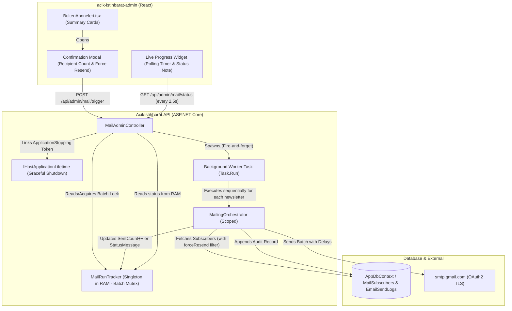

# Implementation-Plan-manual-newsletter-trigger

**Date:** 2026-09-24  
**Source Specification:** Session context, architectural blueprint, and Senior Architect Evaluation Report  
**Projects Affected:** `AcikIstihbarat.API`, `acik-istihbarat-admin`  
**Status:** Completed & Verified  

---

## 1. Executive Summary

This feature empowers administrators to manually trigger newsletter email broadcasts (`AcikGazete`, `AcikKose`, or both) directly from the admin dashboard without waiting for automated cron schedules. To safeguard deliverability and server health, long-running email jobs are executed asynchronously in the background with polite per-recipient pacing. A singleton in-memory tracker prevents conflicting duplicate sends (concurrency locking) across single or multi-newsletter batches, gracefully handles server shutdowns via `IHostApplicationLifetime`, and delivers sub-millisecond status updates for a live progress bar in the admin UI without burdening the database.

---

## 2. Architecture Overview

### What is being built

1. **In-Memory Concurrency & Progress Tracker (`MailRunTracker`):** A thread-safe singleton service managing execution state (`IsBatchActive`, `CurrentNewsletterKey`, `SentCount`, `SuccessCount`, `FailureCount`, `TotalRecipients`, `StatusMessage`). It serves as an active mutex to disallow overlapping sends across the entire batch lifecycle and acts as the high-speed data source for polling.
2. **Orchestrator Resend & Progress Hook:** [`MailingOrchestrator.cs`](file:///c:/Belgelerim/yazilim/calisma-projeleri/AcikIstihbarat-2026/AcikIstihbarat.API/Services/MailingOrchestrator.cs) is extended to accept a `forceResend` boolean parameter (bypassing the `LastSentAt == today` filter), to broadcast progress to the tracker, and to set explicit completion status when `toSend.Count == 0`.
3. **Admin Trigger & Status Endpoints:** 
   - `POST /api/admin/mail/trigger`: Validates concurrency locks, links to `IHostApplicationLifetime.ApplicationStopping`, spins off a scoped background task via `Task.Run` with `IServiceScopeFactory`, and immediately returns `202 Accepted`.
   - `GET /api/admin/mail/status`: Reads current run metrics directly from RAM in 0.01 ms with zero database queries.
4. **Admin UI Modal & Live Progress Banner:** [`BultenAboneleri.tsx`](file:///c:/Belgelerim/yazilim/calisma-projeleri/AcikIstihbarat-2026/acik-istihbarat-admin/src/pages/BultenAboneleri.tsx) gains per-newsletter trigger buttons, a safety confirmation modal detailing recipient counts and a `forceResend` checkbox, and a polling progress widget that updates every 2.5 seconds with informative feedback for both active sending and zero-recipient states.

### Component Diagram

---

## 3. Dependency Analysis

### 3.1 Existing Dependencies Affected

| # | Dependency | Location / Path | Change Required | Risk |
|---|------------|-----------------|-----------------|------|
| DEP-1 | `IMailingOrchestrator.cs` | `AcikIstihbarat.API/Services/` | Update interface signature of `RunScheduleAsync` to accept `bool forceResend = false`. | Low |
| DEP-2 | `MailingOrchestrator.cs` | `AcikIstihbarat.API/Services/` | Ingest `IMailRunTracker`, bypass `LastSentAt` filter when `forceResend == true`, report status increments on each send, handle `toSend.Count == 0`. | Medium |
| DEP-3 | `MailSchedulerBackgroundService.cs` | `AcikIstihbarat.API/Services/` | Ensure automated scheduler passes `forceResend: false` cleanly with no regression. | Low |
| DEP-4 | `MailAdminController.cs` | `AcikIstihbarat.API/Controllers/Admin/` | Add `POST trigger` and `GET status` actions with admin authorization and `IHostApplicationLifetime`. | Low |
| DEP-5 | `Program.cs` | `AcikIstihbarat.API/` | Register `IMailRunTracker` as a `Singleton`. | Low |
| DEP-6 | `BultenAboneleri.tsx` | `acik-istihbarat-admin/src/pages/` | Add trigger buttons, confirmation modal, and polling progress card. | Low |

### 3.2 New Dependencies Created

| # | New Dependency | Location / Path | Purpose | Notes |
|---|----------------|-----------------|---------|-------|
| NEW-1 | `MailRunStatus.cs` | `AcikIstihbarat.API/Models/Entities/` or `DTOs/` | In-memory state entity tracking live progress counters, batch state, timestamps, and status messages. | Pure POCO. |
| NEW-2 | `IMailRunTracker.cs` | `AcikIstihbarat.API/Services/` | Interface declaring thread-safe batch mutex and progress reporting contracts. | Injected into Controller and Orchestrator. |
| NEW-3 | `MailRunTracker.cs` | `AcikIstihbarat.API/Services/` | Thread-safe singleton implementing `IMailRunTracker`. | Uses `ConcurrentDictionary` and `lock`. |
| NEW-4 | `TriggerMailRequest.cs` | `AcikIstihbarat.API/Models/DTOs/` | Request DTO containing `NewsletterKeys` (`List<string>`) and `ForceResend` (`bool`). | Validates non-empty newsletter list. |
| NEW-5 | `MailRunStatusDto.cs` | `AcikIstihbarat.API/Models/DTOs/` | Response DTO providing active batch run stats, counts, status messages, and calculated progress percentages. | Serialized to client polling requests. |

### 3.3 Integration Points

| # | This Component | Connects To | Protocol / Method | Contract |
|---|----------------|------------|-------------------|----------|
| INT-1 | `MailAdminController` | `MailRunTracker` | C# DI (Singleton) | `TryStartBatchRun`, `GetStatus`, `IsAnyRunActive` |
| INT-2 | `MailAdminController` | `IHostApplicationLifetime` | C# DI | `ApplicationStopping` cancellation token link |
| INT-3 | `MailingOrchestrator` | `MailRunTracker` | C# DI (Singleton) | `UpdateProgress`, `CompleteBatchRun`, `SetStatusMessage` |
| INT-4 | `BultenAboneleri.tsx` | `MailAdminController` | REST / Axios | `POST /api/admin/mail/trigger`, `GET /api/admin/mail/status` |

---

## 4. Phased Implementation Plan

---

### Phase 1 — In-Memory Concurrency Lock & Run Tracker

**Goal:** Establish the thread-safe singleton state manager for execution locks and metrics across single and multi-newsletter batch operations.  
**Estimated Complexity:** Low  
**Prerequisites:** None.

#### Tasks

- [ ] **TASK-1.1** — Create in-memory state model `MailRunStatus`
  - **What:** Define `MailRunStatus` with `BatchId`, `ActiveNewsletterKeys`, `CurrentNewsletterKey`, `IsRunning`, `TotalRecipients`, `SentCount`, `SuccessCount`, `FailureCount`, `StatusMessage`, `StartedAtUtc`, `FinishedAtUtc`, and `LastError`.
  - **Where:** `AcikIstihbarat.API/Models/DTOs/MailRunStatus.cs`
  - **Acceptance Criteria:** Model compiles and includes default non-null initialization.
- [ ] **TASK-1.2** — Define `IMailRunTracker` interface
  - **What:** Declare signatures for `bool TryStartBatchRun(List<string> newsletterKeys, int totalRecipients)`, `void SetCurrentNewsletter(string key)`, `void UpdateProgress(bool success, string? error = null)`, `void SetStatusMessage(string message)`, `void CompleteBatchRun()`, `MailRunStatus GetCurrentStatus()`, and `bool IsAnyRunActive()`.
  - **Where:** `AcikIstihbarat.API/Services/IMailRunTracker.cs`
  - **Acceptance Criteria:** Clear docstrings explaining thread-safety guarantees and batch lifecycle management.
- [ ] **TASK-1.3** — Implement thread-safe `MailRunTracker`
  - **What:** Implement `IMailRunTracker` using an internal lock object (`private readonly object _lock = new()`) to guarantee atomic batch lock acquisition across multi-newsletter runs.
  - **Where:** `AcikIstihbarat.API/Services/MailRunTracker.cs`
  - **Acceptance Criteria:** `TryStartBatchRun` atomically rejects second attempts if any run is active; `UpdateProgress` thread-safely increments counters; lock is held for the entire multi-newsletter run until `CompleteBatchRun()` is invoked.
- [ ] **TASK-1.4** — Unit test `MailRunTracker` concurrency behavior
  - **What:** Write an xUnit test with parallel threads attempting `TryStartBatchRun` simultaneously.
  - **Where:** `AcikIstihbarat.API.Tests/MailRunTrackerTests.cs`
  - **Acceptance Criteria:** Exactly one caller acquires the lock; subsequent callers return `false`.
- [ ] **TASK-1.5** — Register `IMailRunTracker` in DI
  - **What:** Register `builder.Services.AddSingleton<IMailRunTracker, MailRunTracker>();` in `Program.cs`.
  - **Where:** `AcikIstihbarat.API/Program.cs`
  - **Acceptance Criteria:** Application starts cleanly without DI lifetime exceptions.

#### Phase 1 Definition of Done
- [ ] Concurrency unit tests pass.
- [ ] `IMailRunTracker` resolves as a valid singleton instance across service scopes.

---

### Phase 2 — Orchestrator Enhancement (`forceResend` & Reporting)

**Goal:** Equip `MailingOrchestrator` to bypass daily deduplication when instructed, report live progress, and handle zero-recipient runs explicitly.  
**Estimated Complexity:** Medium  
**Prerequisites:** Phase 1 complete.

#### Tasks

- [ ] **TASK-2.1** — Update `IMailingOrchestrator` interface signature
  - **What:** Add optional `bool forceResend = false` parameter to `RunScheduleAsync`.
  - **Where:** `AcikIstihbarat.API/Services/IMailingOrchestrator.cs`
  - **Acceptance Criteria:** Method signature: `Task RunScheduleAsync(int scheduleId, bool forceResend = false, CancellationToken ct = default);`.
- [ ] **TASK-2.2** — Inject `IMailRunTracker` into `MailingOrchestrator`
  - **What:** Update constructor of `MailingOrchestrator` to receive `IMailRunTracker` and assign to `private readonly IMailRunTracker _tracker`.
  - **Where:** `AcikIstihbarat.API/Services/MailingOrchestrator.cs`
  - **Acceptance Criteria:** Existing constructor bindings continue to work via DI container.
- [ ] **TASK-2.3** — Implement `forceResend` filter logic
  - **What:** Update subscriber filtering: `subscribers.Where(s => forceResend || s.LastSentAt is null || IstanbulClock.ToLocal(s.LastSentAt.Value).Date != today).ToList()`.
  - **Where:** `AcikIstihbarat.API/Services/MailingOrchestrator.cs`
  - **Acceptance Criteria:** When `forceResend == true`, subscribers sent to earlier today are included in `toSend`. When `false`, they are skipped.
- [ ] **TASK-2.4** — Handle zero-recipient runs explicitly (`toSend.Count == 0`)
  - **What:** When `toSend.Count == 0`, set `_tracker.SetStatusMessage("Tüm abonelere bugün zaten gönderilmiş (0 alıcı)")` before returning.
  - **Where:** `AcikIstihbarat.API/Services/MailingOrchestrator.cs`
  - **Acceptance Criteria:** Prevents the UI from displaying an empty hanging state; sets an informative notice.
- [ ] **TASK-2.5** — Broadcast incremental progress in send loop
  - **What:** Call `_tracker.UpdateProgress` on every iteration—recording success in the `try` block and error details in the `catch` block.
  - **Where:** `AcikIstihbarat.API/Services/MailingOrchestrator.cs`
  - **Acceptance Criteria:** Tracker counters increment immediately after each email is dispatched.
- [ ] **TASK-2.6** — Finalize tracker status in `finally` block
  - **What:** Ensure `_tracker.CompleteBatchRun()` is called in the top-level batch controller loop upon completion or cancellation.
  - **Where:** `AcikIstihbarat.API/Services/MailingOrchestrator.cs` and `MailAdminController.cs`
  - **Acceptance Criteria:** `IsRunning` flag in tracker is always reset to `false` even if an unhandled exception or abort occurs.
- [ ] **TASK-2.7** — Verify `MailSchedulerBackgroundService` compatibility
  - **What:** Inspect `MailSchedulerBackgroundService.cs` call to `RunScheduleAsync` to ensure it passes `stoppingToken` and relies on default `forceResend: false`.
  - **Where:** `AcikIstihbarat.API/Services/MailSchedulerBackgroundService.cs`
  - **Acceptance Criteria:** Background cron continues normal operation with zero behavioral changes.

#### Phase 2 Definition of Done
- [ ] Orchestrator sends to all subscribers when `forceResend == true`.
- [ ] `toSend.Count == 0` generates an explicit status message instead of a silent return.
- [ ] Progress increments dynamically on each email send.

---

### Phase 3 — Admin API Endpoints

**Goal:** Expose endpoints for non-blocking trigger invocation with host-lifetime graceful shutdown and rapid progress polling.  
**Estimated Complexity:** Low  
**Prerequisites:** Phase 1 & 2 complete.

#### Tasks

- [ ] **TASK-3.1** — Define `TriggerMailRequest` DTO
  - **What:** Create request model with `List<string> NewsletterKeys` and `bool ForceResend`.
  - **Where:** `AcikIstihbarat.API/Models/DTOs/TriggerMailRequest.cs`
  - **Acceptance Criteria:** Includes data annotations rejecting null/empty lists.
- [ ] **TASK-3.2** — Define `MailRunStatusDto` and mapping
  - **What:** Create response DTO with `ActiveNewsletterKeys`, `CurrentNewsletterKey`, `IsRunning`, `TotalRecipients`, `SentCount`, `SuccessCount`, `FailureCount`, `StatusMessage`, `ProgressPercentage`, and `StartedAtUtc`.
  - **Where:** `AcikIstihbarat.API/Models/DTOs/MailRunStatusDto.cs`
  - **Acceptance Criteria:** Calculates `ProgressPercentage` safely (avoids division by zero when `TotalRecipients == 0`).
- [ ] **TASK-3.3** — Implement `POST /api/admin/mail/trigger` with graceful shutdown link
  - **What:** Validate request; check `_tracker.IsAnyRunActive()`; if active, return `409 Conflict`. Otherwise, calculate total recipients across requested schedules, acquire batch lock, link `IHostApplicationLifetime.ApplicationStopping` token via `CancellationTokenSource.CreateLinkedTokenSource`, launch `Task.Run` with `IServiceScopeFactory`, and return `202 Accepted`.
  - **Where:** `AcikIstihbarat.API/Controllers/Admin/MailAdminController.cs`
  - **Acceptance Criteria:** Endpoint returns in < 50ms; lock is held across all selected newsletters until the last finishes; worker aborts cleanly if server shuts down.
- [ ] **TASK-3.4** — Validate newsletter keys in trigger endpoint
  - **What:** Reject requests with invalid keys not in `NewsletterDisplayNames.Keys` with `400 Bad Request`.
  - **Where:** `AcikIstihbarat.API/Controllers/Admin/MailAdminController.cs`
  - **Acceptance Criteria:** Returns descriptive error message if unknown newsletter key is passed.
- [ ] **TASK-3.5** — Implement `GET /api/admin/mail/status`
  - **What:** Query `_tracker.GetCurrentStatus()` and return the unified DTO.
  - **Where:** `AcikIstihbarat.API/Controllers/Admin/MailAdminController.cs`
  - **Acceptance Criteria:** Response latency is < 5ms; zero SQL queries executed.
- [ ] **TASK-3.6** — Unit test controller endpoints
  - **What:** Test `POST trigger` (202, 400, 409 responses) and `GET status` using mocked dependencies.
  - **Where:** `AcikIstihbarat.API.Tests/MailAdminControllerTests.cs`
  - **Acceptance Criteria:** All test assertions pass.

#### Phase 3 Definition of Done
- [ ] `POST trigger` initiates background execution and returns `202`.
- [ ] Second simultaneous trigger returns `409 Conflict`.
- [ ] `GET status` returns real-time in-memory progress metrics.

---

### Phase 4 — Admin Panel UI & Polling Integration

**Goal:** Deliver an intuitive, safe user experience with confirmation prompts, real-time visual progress, and zero-recipient notices in the React admin panel.  
**Estimated Complexity:** Medium  
**Prerequisites:** Phase 3 complete.

#### Tasks

- [ ] **TASK-4.1** — Add API client methods in frontend
  - **What:** Add `triggerMailRun(newsletterKeys: string[], forceResend: boolean)` and `getMailRunStatus()` using existing Axios instance.
  - **Where:** `acik-istihbarat-admin/src/lib/api.ts` (or `BultenAboneleri.tsx`)
  - **Acceptance Criteria:** Strongly typed with TypeScript interfaces matching backend DTOs.
- [ ] **TASK-4.2** — Add "Manuel Gönder" button to newsletter summary cards
  - **What:** Add trigger button with `Send` icon from `lucide-react` on each card (`AcikGazete` and `AcikKose`).
  - **Where:** `acik-istihbarat-admin/src/pages/BultenAboneleri.tsx`
  - **Acceptance Criteria:** Button is disabled when an active run is in progress.
- [ ] **TASK-4.3** — Add "Her İkisini de Gönder" global trigger action
  - **What:** Add a secondary action button in the top toolbar to trigger both newsletters sequentially.
  - **Where:** `acik-istihbarat-admin/src/pages/BultenAboneleri.tsx`
  - **Acceptance Criteria:** Opens confirmation modal with both newsletters pre-selected.
- [ ] **TASK-4.4** — Implement `SafetyConfirmationModal` component
  - **What:** Create modal displaying target newsletter title(s), total active subscriber count, and a warning note. Include a styled checkbox: *"Bugün zaten gönderilmiş olan abonelere tekrar gönder (Force Resend)"*.
  - **Where:** `acik-istihbarat-admin/src/components/SafetyConfirmationModal.tsx` (or inside `BultenAboneleri.tsx`)
  - **Acceptance Criteria:** Cancel closes modal; Confirm triggers API call and closes modal.
- [ ] **TASK-4.5** — Implement `MailProgressWidget` component
  - **What:** Create a visual progress banner/card showing active newsletter, progress bar `(Sent / Total * 100%)`, badge counts (`X / Y gönderildi, Z hatalı`), and support rendering `StatusMessage` (for zero-recipient notices).
  - **Where:** `acik-istihbarat-admin/src/components/MailProgressWidget.tsx` (or inside `BultenAboneleri.tsx`)
  - **Acceptance Criteria:** Smooth transition animations on progress bar width; renders info banner if `totalRecipients === 0`.
- [ ] **TASK-4.6** — Implement polling hook with auto-cleanup
  - **What:** Start `setInterval` every 2500ms on run start; fetch `GET /mail/status`; update state; automatically clear interval when `isRunning === false`.
  - **Where:** `acik-istihbarat-admin/src/pages/BultenAboneleri.tsx`
  - **Acceptance Criteria:** Interval is cleaned up on component unmount; no memory leaks; shows success toast on completion.
- [ ] **TASK-4.7** — Handle conflict and error states in UI
  - **What:** Catch `409 Conflict` error on trigger and display friendly notification: *"Şu anda devam eden bir gönderim var."*
  - **Where:** `acik-istihbarat-admin/src/pages/BultenAboneleri.tsx`
  - **Acceptance Criteria:** UI does not freeze or break if backend rejects request.

#### Phase 4 Definition of Done
- [ ] Admin can initiate sending for one or both newsletters via confirmation modal.
- [ ] Progress bar updates smoothly every 2.5s and concludes with a success banner or informational note.

---

### Phase 5 — Testing, Dry-Run Verification & Polish

**Goal:** Validate complete end-to-end flow under normal and edge conditions.  
**Estimated Complexity:** Low  
**Prerequisites:** Phases 1–4 complete.

#### Tasks

- [ ] **TASK-5.1** — Verify flow in Dry-Run mode
  - **What:** Set `MailOptions.DryRun = true` and trigger newsletter from admin panel.
  - **Where:** Local environment (Backend + Frontend)
  - **Acceptance Criteria:** Backend logs `[DRYRUN]` output; UI progress bar reaches 100%; zero real emails sent to subscribers.
- [ ] **TASK-5.2** — Verify concurrency lock under rapid clicks
  - **What:** Click trigger in rapid succession across two browser windows.
  - **Where:** Admin UI
  - **Acceptance Criteria:** First click initiates run; second click is rejected with 409 Conflict banner; no dual background execution occurs.
- [ ] **TASK-5.3** — Verify `forceResend = false` deduplication & status message
  - **What:** Trigger newsletter once (sends to subscribers); trigger again with `forceResend = false`.
  - **Where:** Admin UI & DB `EmailSendLogs`
  - **Acceptance Criteria:** Second run finds 0 recipients; UI displays *"Tüm abonelere bugün zaten gönderilmiş (0 alıcı)"* banner.
- [ ] **TASK-5.4** — Verify `forceResend = true` override
  - **What:** Trigger newsletter with `forceResend = true` on the same day.
  - **Where:** Admin UI & DB `EmailSendLogs`
  - **Acceptance Criteria:** All active subscribers receive the newsletter again; new send logs are created.
- [ ] **TASK-5.5** — Verify browser refresh during active run
  - **What:** Trigger run; refresh browser tab mid-progress.
  - **Where:** Admin UI
  - **Acceptance Criteria:** Page loads, calls `GET /status`, detects `isRunning === true`, restores the progress widget, and continues polling seamlessly.
- [ ] **TASK-5.6** — Code review & lint check
  - **What:** Run `dotnet build` and `npm run lint` / build check across both projects.
  - **Where:** `AcikIstihbarat.API` and `acik-istihbarat-admin`
  - **Acceptance Criteria:** Zero build warnings or lint errors.

---

## 5. Full Task List (Flat Reference)

| Task ID | Phase | Title | Complexity | Status |
|---------|-------|-------|------------|--------|
| TASK-1.1 | 1 | Create in-memory state model `MailRunStatus` | S | ☑ |
| TASK-1.2 | 1 | Define `IMailRunTracker` interface with batch contracts | S | ☑ |
| TASK-1.3 | 1 | Implement thread-safe `MailRunTracker` (batch mutex) | M | ☑ |
| TASK-1.4 | 1 | Unit test `MailRunTracker` concurrency behavior | S | ☑ |
| TASK-1.5 | 1 | Register `IMailRunTracker` in DI (`Program.cs`) | S | ☑ |
| TASK-2.1 | 2 | Update `IMailingOrchestrator` interface signature | S | ☑ |
| TASK-2.2 | 2 | Inject `IMailRunTracker` into `MailingOrchestrator` | S | ☑ |
| TASK-2.3 | 2 | Implement `forceResend` filter logic | S | ☑ |
| TASK-2.4 | 2 | Handle zero-recipient runs explicitly (`toSend.Count == 0`) | S | ☑ |
| TASK-2.5 | 2 | Broadcast incremental progress in send loop | S | ☑ |
| TASK-2.6 | 2 | Finalize tracker status in `finally` block | S | ☑ |
| TASK-2.7 | 2 | Verify `MailSchedulerBackgroundService` compatibility | S | ☑ |
| TASK-3.1 | 3 | Define `TriggerMailRequest` DTO with validation | S | ☑ |
| TASK-3.2 | 3 | Define `MailRunStatusDto` and mapping | S | ☑ |
| TASK-3.3 | 3 | Implement `POST /api/admin/mail/trigger` with `IHostApplicationLifetime` | M | ☑ |
| TASK-3.4 | 3 | Validate newsletter keys in trigger endpoint | S | ☑ |
| TASK-3.5 | 3 | Implement `GET /api/admin/mail/status` | S | ☑ |
| TASK-3.6 | 3 | Unit test controller endpoints | S | ☑ |
| TASK-4.1 | 4 | Add API client methods in frontend | S | ☑ |
| TASK-4.2 | 4 | Add "Manuel Gönder" button to newsletter summary cards | S | ☑ |
| TASK-4.3 | 4 | Add "Her İkisini de Gönder" global trigger action | S | ☑ |
| TASK-4.4 | 4 | Implement `SafetyConfirmationModal` component | M | ☑ |
| TASK-4.5 | 4 | Implement `MailProgressWidget` component with status note | M | ☑ |
| TASK-4.6 | 4 | Implement polling hook with auto-cleanup | M | ☑ |
| TASK-4.7 | 4 | Handle conflict (409) and error states in UI | S | ☑ |
| TASK-5.1 | 5 | Verify flow in Dry-Run mode | S | ☑ |
| TASK-5.2 | 5 | Verify concurrency lock under rapid clicks | S | ☑ |
| TASK-5.3 | 5 | Verify `forceResend = false` deduplication & status message | S | ☑ |
| TASK-5.4 | 5 | Verify `forceResend = true` override | S | ☑ |
| TASK-5.5 | 5 | Verify browser refresh during active run | S | ☑ |
| TASK-5.6 | 5 | Code review & lint check across API and Admin | S | ☑ |

---

## 6. Risk Register

| # | Risk | Likelihood | Impact | Mitigation |
|---|------|-----------|--------|------------|
| R-1 | Background thread dies if app pool recycles or container restarts mid-batch | Low | Med | Progress recorded per-message in DB `EmailSendLogs`; `IHostApplicationLifetime` cancels cleanly. |
| R-2 | Admin closes tab during sending | Low | Low | Sending runs in backend task independent of browser session; reopening tab queries `GET /status` and resumes live tracking. |
| R-3 | Gmail SMTP quota exceeded during massive manual blast | Low | High | Existing orchestrator guardrails (`MaxSendsPerRun`, delay pacing) remain active. |

---

## 7. Open Questions

*All prior architectural gaps, grilling items, and evaluation findings were resolved and incorporated.* (Zero blocking questions remaining).

---

## 8. Out of Scope

- Automated test-send to an arbitrary email address (explicitly ruled out during grilling).
- Triggering pending email verification tokens (reserved for automated background worker).
- Multi-server distributed locking (Redis/RedLock) — in-memory singleton lock is optimal and sufficient for single-container/monolith deployment.

---

## 9. Suggested Next Steps

1. Hand this plan to the developer or coding agent to begin **Phase 1**.
2. Execute phases sequentially from 1 to 5.
