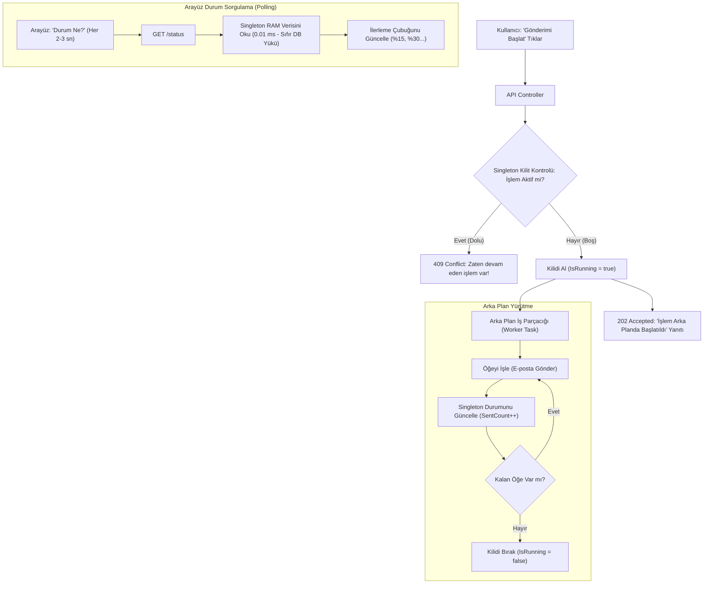

# 🎓 Ders Notu / Slide Brief: Arka Plan İşlerinde (Background Jobs) Neden Singleton Kullanmalıyız?

> **Meta Bilgi:** 2026-09-24 | Oturum: Web Mimarisi & Arka Plan Süreçleri | Format: LinkedIn Carousel Slide Seti | Eğitmen: Antigravity Teacher Agent

---

## 🤖 Downstream LLM Prompt (Slide Dönüştürücü Direktifi)

> **Kullanım Notu:** Bu rehber, LinkedIn Carousel (PDF slayt seti) veya teknik flood formatına dönüştürülmek üzere tasarlanmış modüler bilgi blokları içerir. Aşağıdaki başlıkların her biri 1-2 slaytlık bağımsız bir konsepti temsil eder. Slaytları oluştururken gereksiz dolgu cümlelerden kaçının, maddeleri doğrudan punchy infografik metinlere dönüştürün. Kod örneklerini ve analojileri sade tutun.

---

## 📌 1. Genel Kullanım Senaryosu & Problem (The Hook)
*Neden buradayız? Gerçek hayatta bu ne zaman karşımıza çıkar?*

- **Senaryo / Problem:** Yönetim panelinden tek tıkla binlerce kullanıcıya bülten e-postası gönderme, toplu SMS tetikleme veya büyük veri raporları dışa aktarma gibi uzun süren işlemler başlatmak istiyoruz.
- **Neden Önemli?**
  - Web istekleri (HTTP Requests) saniyenin onda biri sürmelidir. 5-10 dakika sürecek bir işlemi istemcinin beklemesine izin verirseniz tarayıcı 60. saniyede **HTTP 504 Gateway Timeout** hatası verir.
  - İşlem arka plana (background) atıldığında ise iki büyük kriz doğar:
    1. İki farklı yöneticinin aynı anda butona basıp aynı kişilere çift mesaj göndermesi (**Race Condition / Mükerrer Gönderim**).
    2. Arayüzde *"İlerleme: %35"* gibi bir çubuk göstermek için her 2 saniyede bir veritabanına sorgu atıp ana veritabanını felç etmek (**Database Hammering**).

---

## 🏗️ 2. Mimari Tasarım & Kritik Akış (Architecture & Flow)
*Büyük resim ve veri/durum akışı nasıl işliyor?*

- **Akışın Kritik Noktası:** Web sunucusunun HTTP isteğini bloke etmeden derhal `202 Accepted` dönmesi ve arka plandaki uzun koşunun hem kilit bilgisini hem de anlık sayaçlarını **ortak bellekteki tek bir nesneye (Singleton)** yazmasıdır.

---

## 💡 3. Pratik Bilgi Kırıntıları & "Aha!" Anları (Practical Nuggets)
*Kıdemli yazılımcıların bildiği, dokümantasyonun satır aralarında gizlenen incelikler.*

- ⚡ **Disposable vs. Singleton Ayrımı:** Web çatılarında (örneğin ASP.NET Core) standart sınıflar (Scoped/Transient) her HTTP isteği geldiğinde doğar ve yanıt bittiğinde çöp toplayıcı (Garbage Collector) tarafından yok edilir. Ancak Singleton, sunucu çalıştığı sürece bellekte (RAM) tek kopya olarak yaşamaya devam eder.
- ⚡ **Veritabanı Yorgunluğu (I/O Bottleneck):** Sırf arayüzde ilerleme çubuğu göstermek için `SELECT COUNT(*) FROM Logs` sorgusunu 2 saniyede bir çalıştırmak, veritabanı disk I/O ve bağlantı havuzunu (Connection Pool) tüketir. Sayaçları RAM'de tutmak maliyeti neredeyse sıfıra indirir.
- ⚡ **Thread-Safety Zorunluluğu:** Singleton sınıfına aynı anda hem arka plan işi (yazma) hem de admin kullanıcılarının durum sorguları (okuma) erişir. Bu yüzden sayaçlar ve sözlükler `lock`, `Interlocked` veya `ConcurrentDictionary` gibi iş parçacığı güvenli (thread-safe) yapılarla korunmalıdır.

---

## 🛠️ 4. Adım Adım "Nasıl Yapılır?" İş Akışı (How-To Workflow)
*Aynı mimariyi kurmak isteyen bir geliştirici hangi adımları izlemeli?*

1. **Durum Modelini ve Takipçi Sınıfını Tasarla:**
   - İçerisinde `IsRunning`, `TotalCount`, `SentCount`, `SuccessCount` gibi alanları barındıran bir takip sınıfı oluştur.
2. **Servisi Konteyner'a Singleton Olarak Kaydet:**
   - Bağımlılık enjeksiyonu (DI) ayarlarında servisi `AddSingleton<IJobTracker, JobTracker>()` olarak kaydet.
3. **Tetikleme Uç Noktasında Kilidi Denetle:**
   - API controller içinde `tracker.TryStart()` metodunu çağır. Eğer zaten çalışan bir görev varsa derhal `409 Conflict` dön.
4. **İşi Arka Plana Devret ve 202 Dön:**
   - İşi arka plan iş parçacığına (Task / Queue) devredip kullanıcıya bekletmeden `202 Accepted` ("İşlem sıraya alındı") dön.
5. **Hafif Durum Sorgulama Uç Noktası Aç:**
   - `GET /status` ucunda hiçbir veritabanı sorgusu yapmadan yalnızca Singleton takipçideki RAM değerlerini JSON olarak döndür.

---

## ⚠️ 5. Kritik Sorunlar, Hatalar ve Çözümleri (Pitfalls & Gotchas)

- **Karşılaşılan Hata / Belirti:** `InvalidOperationException: Cannot consume scoped service from singleton` (Captive Dependency).
  - **Kök Neden:** Singleton bir servis sonsuza kadar yaşadığı için, içerisine doğrudan HTTP isteğine bağlı (Scoped) bir Veritabanı Bağlamı (DbContext) enjekte edilemez.
  - **Uygulanan Reçete:** Arka plan işi içinde kısa ömürlü bağlamları açmak için `IServiceScopeFactory` kullanarak özel bir kapsam (`using var scope = scopeFactory.CreateScope()`) oluşturulmalıdır.

- **Karşılaşılan Hata / Belirti:** Sunucu yeniden başladığında ilerleme bilgisinin sıfırlanması.
  - **Kök Neden:** Singleton verileri RAM'de tutulur; sunucu yeniden başlarsa (restart/deploy) RAM silinir.
  - **Uygulanan Reçete:** Anlık ilerleme RAM'de tutulmalı, ancak işin kalıcı sonucu (örneğin işlem bittiğinde oluşturulan özet kayıt) mutlaka veritabanına yazılmalıdır.

---

## 🧭 6. En İyi Uygulama Yolları & Araç Kullanımı (Best Practices & Tooling)

- 📐 **Clean Code & Desen:** **Singleton Pattern + Status Tracker.** Kısa ömürlü istekler ile uzun ömürlü arka plan iş parçacıkları arasında köprü kurmanın en sade ve etkin desenidir.
- 🔧 **Polite Rate Limiting:** Toplu gönderimlerde hedef sistemin (örneğin SMTP/API) sizi engellememesi için her döngü arasına 1-2 saniyelik kontrollü gecikmeler (`Task.Delay`) ekleyin.
- 🛡️ **Graceful Degradation:** İstemci tarafında (React / Vue) sorgulama aralığını (polling) arka plan işi tamamlandığı anda (`isAnyRunning === false`) otomatik olarak durdurun (`clearInterval`).

---

## 🧠 7. Kavram Sözlüğü (Concept Spotlight)
*Junior/Mid-level geliştiricilere hap gibi terim açıklaması.*

- **Singleton**: Ofisin duvarındaki tek bir büyük beyaz tahta gibidir. Herkes masasında ayrı bir kağıt kullanır (Scoped), ama şirketteki tek ortak duyuru tahtasına bakarak birbirinin ne yaptığını anlar.
- **Race Condition (Yarış Durumu)**: İki kişinin aynı anda tek kalan sandalyeye oturmaya çalışması gibi, iki sürecin aynı anda aynı işi yapmaya kalkışıp sistemi bozması durumu.
- **Polling (Yoklama)**: Arka koltuktaki çocuğun her 10 saniyede bir *"Geldik mi?"* diye sorması gibi, arayüzün sunucuya belirli aralıklarla *"İş bitti mi?"* diye sorması.
- **Captive Dependency (Tutsak Bağımlılık)**: Ömrü çok kısa olan bir nesnenin (günlük gazete), ömrü sonsuz olan bir nesneye (kütüphane arşivi) hapsolup bozulması.

---

## 😂 8. Günün Yazılımcı Fıkrası / Seansın İronik Özeti (Humorous Take)

> **Junior Dev:** *"Kullanıcı arayüzüne havalı bir progress bar ekleyelim dedik; her 500 milisaniyede bir veritabanına `COUNT(*)` attığımız için ana sunucu göçtü. E-postalar gitmedi ama progress barımız %4'te harika görünüyordu!"*  
>  
> **Senior Guru (gözlerini ovuşturup kahvesinden derin bir yudum alır):**  
> *"Tebrikler evlat. Kendi prod veritabanına içeriden DDoS saldırısı düzenleyen ilk stajyer olarak tarihe geçtin. Şimdi o tabloyu rahat bırak ve git bellekte bir Singleton sayaç tut."*

---

## 🎯 9. Paket Paket Özet (Key Takeaways - Slayt Kapanışı)
*Akılda kalması gereken 3 altın kural:*

- 🔹 **1. Uzun işleri HTTP akışında bekletme:** 1 saniyeden uzun sürecek toplu işleri arka plana al ve `202 Accepted` dön.
- 🔹 **2. Singleton'ı trafik polisi yap:** Aynı işin iki kez çalışmasını engellemek için RAM tabanlı bir kilit mekanizması kullan.
- 🔹 **3. Veritabanını sayaç için yorma:** Canlı ilerleme ve durum verilerini RAM'de Singleton ile sakla; veritabanını sadece kalıcı sonuçlar için kullan.
