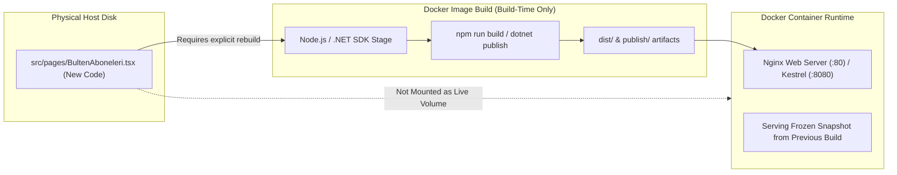
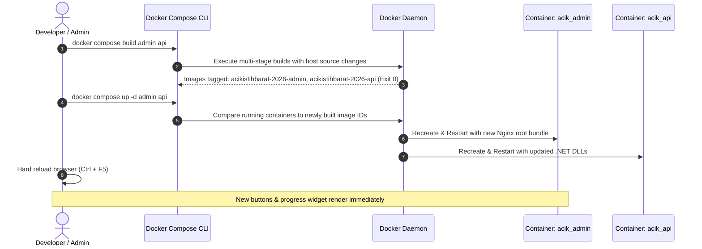

# Lessons Learned: Docker Multi-Stage Builds & The "Bring Live" Process

**Date:** 2026-09-24  
**Project:** AcikIstihbarat-2026 (`acik-istihbarat-admin`, `AcikIstihbarat.API`, `docker-compose.yml`)  
**Topic:** Troubleshooting Containerized Environments, Static Asset Baking, the "Browser Cache" Illusion, and Authoritative Service Synchronization  

---

## 1. Incident Summary

Following the completion of the manual newsletter trigger feature ([BultenAboneleri.tsx](file:///c:/Belgelerim/yazilim/calisma-projeleri/AcikIstihbarat-2026/acik-istihbarat-admin/src/pages/BultenAboneleri.tsx) and [MailAdminController.cs](file:///c:/Belgelerim/yazilim/calisma-projeleri/AcikIstihbarat-2026/AcikIstihbarat.API/Controllers/Admin/MailAdminController.cs)), an administrator logged into the local admin panel at `http://localhost:15173` to test the new functionality. 

Despite repeated hard refreshes (`Ctrl + F5`), the new UI controls (the *"Her İkisini de Gönder"* header button and the per-newsletter *"Manuel Gönder"* actions) were completely absent. The page continued to display the previous version of the admin panel without throwing any errors in the browser console.

This document analyzes the architectural root cause, explains the diagnostic discrepancy between code-on-disk versus code-in-container, and establishes an authoritative checklist for bringing features live in containerized stacks.

---

## 2. Root Cause Analysis

### 2.1 The "Browser Cache" Illusion
When frontend changes do not appear after source files are modified, developers intuitively diagnose it as a browser caching issue (Chrome/Edge serving cached `.js` bundles from memory or disk). However, after performing a clean hard refresh and testing in incognito mode, the old UI remained. 

The cache was not in the browser; **the cache was inside the Docker container image.**

### 2.2 Immutable Multi-Stage Builds vs. Live Source Trees
In [docker-compose.yml](file:///c:/Belgelerim/yazilim/calisma-projeleri/AcikIstihbarat-2026/docker-compose.yml#L75-L88), both the frontend admin panel and the backend API are configured as multi-stage production builds:



1. **Frontend (`acik_admin`):**
   - [Dockerfile](file:///c:/Belgelerim/yazilim/calisma-projeleri/AcikIstihbarat-2026/acik-istihbarat-admin/Dockerfile) runs `npm run build` during the build stage to generate static files in `/app/dist`.
   - The runtime stage copies these static files into `/usr/share/nginx/html` and starts Nginx.
   - **Crucially:** [docker-compose.yml](file:///c:/Belgelerim/yazilim/calisma-projeleri/AcikIstihbarat-2026/docker-compose.yml) does not mount `./acik-istihbarat-admin` as a volume into the container. As a result, changes made to `src/` on the host machine remain completely invisible to the running Nginx process.

2. **Backend (`acik_api`):**
   - [Dockerfile](file:///c:/Belgelerim/yazilim/calisma-projeleri/AcikIstihbarat-2026/AcikIstihbarat.API/Dockerfile) executes `dotnet publish` to compile C# source into release binaries in `/app/publish`.
   - Even if the frontend were somehow updated, the running `acik_api` container lacked the new `/api/admin/mail/trigger` and `/api/admin/mail/status` endpoints, which would have resulted in `404 Not Found` errors.

---

## 3. Resolution Workflow: The Authoritative "Bring Live" Process

The issue was resolved by systematically triggering a full image rebuild and service recreation for the affected stack components:



### Execution Commands:
```powershell
# Step 1: Recompile source code inside fresh build stages
docker compose build admin api

# Step 2: Gracefully recreate and restart containers with newly tagged images
docker compose up -d admin api

# Step 3: Validate container age and running state
docker compose ps
```

---

## 4. Key Architectural Lessons Learned

### 1. Identify the Execution Mode: Host Dev vs. Containerized Emulation
* **Local Vite Dev Server (`npm run dev`):** Operates on the host filesystem with Hot Module Replacement (HMR). Code edits reflect in milliseconds.
* **Docker Compose Emulation:** Emulates production environments using immutable compiled artifacts. Code edits on the host **never** propagate automatically unless explicit volume mounts are declared.
* **Rule:** If you are testing via container ports (e.g. `:15173`, `:15128`), you must treat every code revision as a deployment cycle requiring `docker compose build`.

### 2. Verify Container Provenance and Creation Age
* **Lesson:** Running `docker compose ps` or `docker ps` is not just for checking if a container is "Up".
* **Rule:** Always check the `CREATED` column. If your code was saved at `12:10` and `docker compose ps` shows the container was created `25 minutes ago`, the container is mathematically guaranteed to be running stale code.

### 3. Synchronized Dual-Tier Rebuilds
* **Lesson:** Rebuilding only the frontend would have exposed the admin to broken API calls because the backend container also required compilation for the new endpoints.
* **Rule:** When a feature spans both frontend (UI components) and backend (API endpoints/DTOs), always rebuild both services together:
  `docker compose build admin api && docker compose up -d admin api`.

### 4. Client-Side Rendering Conditional Traps
* **Lesson:** In [BultenAboneleri.tsx](file:///c:/Belgelerim/yazilim/calisma-projeleri/AcikIstihbarat-2026/acik-istihbarat-admin/src/pages/BultenAboneleri.tsx#L184), the per-newsletter cards containing the *"Manuel Gönder"* buttons are guarded by `{summary.length > 0 && (...) }`.
* **Rule:** When designing UI features that depend on API data to render action buttons, always ensure top-level action buttons (like *"Her İkisini de Gönder"*) remain in unconditional containers (such as the page header). This ensures that even if the API data fails or is empty, the user can still determine whether the frontend bundle itself is up to date.

---

## 5. Verification Checklist for Future Deployments

Before declaring any feature ready for local or staging verification:

- [ ] **Check Host vs Container Context:** Confirm whether testing on Vite local port (`:5173`) or Docker container port (`:15173`).
- [ ] **Rebuild Modified Containers:** Run `docker compose build <service-name>` for all affected layers.
- [ ] **Recreate Containers:** Run `docker compose up -d <service-name>`.
- [ ] **Inspect Container Age:** Run `docker compose ps` and verify `CREATED` timestamp is strictly newer than the last git edit.
- [ ] **Clear Client Cache:** Perform `Ctrl + F5` (or test in Incognito) to bypass browser-level HTTP 304 caching of static scripts.
